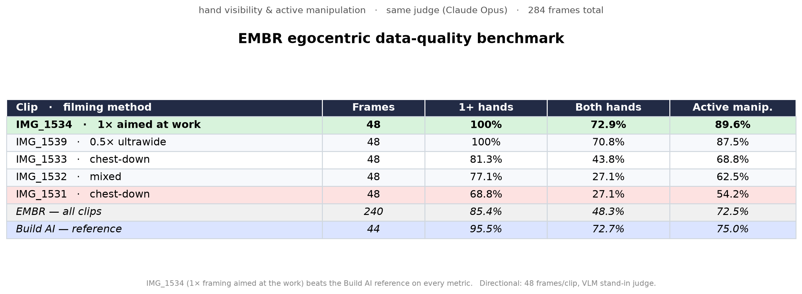

# EMBR — Egocentric Data Pipeline

Turn raw **egocentric (first-person) factory-worker video** into a clean, richly-labeled
dataset that's good enough to train robot manipulation policies on.

The pipeline normalizes messy phone capture, **benchmarks data quality** with a VLM judge,
and **auto-labels** hands + actions (3D hand pose + action captions), with a side-by-side
overlay for demos.



---

## Pipeline

```
RAW egocentric clips (4K HDR, rotated, mixed framing)
   │
   ▼  preprocess.py ........ HDR→SDR tone-map · de-rotate · downscale · frame sampling
processed/ frames
   │
   ▼  benchmark/run_eval.py  VLM (Qwen3-VL-8B) data-quality score:
   │                         % hands-visible · % both-hands · % active-manipulation
   │                         → rank clips / filming methods vs a reference set
   ▼  overlay/ ............. auto-label + visualize:
                              • 3D hand pose  (MediaPipe Hand Landmarker, 21 kp/hand)
                              • action + object caption  (VLM, Qwen3-VL)
                              → hero still · 5s clip · raw|labeled montage
```

Product framing: the **labeled dataset is the deliverable** (path 2); a downstream
retarget + policy-training run is the **validation harness** that proves the labels are
robot-grade (path 1).

---

## Repo layout

| Path | What |
|---|---|
| `preprocess.py` | Normalize clips → frames. Auto-detects HDR (HLG/PQ→bt709), applies iPhone rotation, downscales, samples N evenly-spaced frames/clip. CLI. |
| `benchmark/run_eval.py` | Reproduce Build AI's hand-visibility / active-manipulation benchmark on your clips using **Qwen3-VL-8B** as judge (HF Inference Providers or local vLLM). CLI. See `benchmark/README.md`. |
| `overlay/overlay.py` | Hero **still**: MediaPipe 3D hand pose + VLM caption on one frame. |
| `overlay/video_overlay.py` | **5-second** single-panel overlay clip. |
| `overlay/montage.py` | **Side-by-side** `RAW | AUTO-LABELED` montage across clip moments. |
| `results/` | Example outputs (benchmark table/chart, hero still, montage mp4). |
| `models/` | `hand_landmarker.task` lands here (downloaded by `setup.sh`, git-ignored). |

---

## Setup

```bash
# Python 3.9–3.12 (MediaPipe has no 3.13/3.14 wheels)
python3.11 -m venv .venv && source .venv/bin/activate
bash setup.sh          # installs deps + downloads the MediaPipe model
```

## Usage

**1 — Preprocess** (HDR/rotation/format all handled automatically):
```bash
python preprocess.py --clips-dir ./clips --out-dir processed --frames-per-clip 48
```

**2 — Benchmark data quality** (Qwen3-VL judge — no Google key needed):
```bash
export HF_TOKEN=hf_xxx
python benchmark/run_eval.py --clips-dir ./clips \
  --base-url https://router.huggingface.co/v1 --api-key $HF_TOKEN \
  --model Qwen/Qwen3-VL-8B-Instruct --n-frames 10000
# → summary.json · frames.csv · table.md · benchmark.png
```

**3 — Auto-label + visualize:**
```bash
python overlay/overlay.py          # hero still  → results/hero_overlay.png
python overlay/video_overlay.py    # 5s clip     (set SRC frames at top of file)
python overlay/montage.py          # side-by-side montage (set WINDOWS at top of file)
```

---

## Notes / design decisions

- **Capture quirks handled:** input is 4K **10-bit HLG HDR**, portrait, rotated −90°.
  `preprocess.py` tone-maps to SDR (zscale→hable) and de-rotates — naive extraction looks
  wrong to a VLM.
- **Hand pose = MediaPipe**, not HaMeR. HaMeR needs a CUDA GPU and the **non-commercial,
  registration-gated MANO** model. MediaPipe Hand Landmarker is **Apache-2.0** (ships in a
  product) and runs on CPU/Mac. Swap in HaMeR later for richer 3D **if MANO is licensed**.
- **VLM captions** in the overlays are a Qwen3-VL **stand-in** (authored text) until wired
  to a live Qwen3-VL endpoint; `run_eval.py` already speaks the OpenAI-compatible API.
- **Benchmark validity:** absolute % depends on the judge model — re-judge any reference set
  with the *same* judge before comparing (see `benchmark/README.md`).

---

© EMBR. Proprietary — internal use only.
